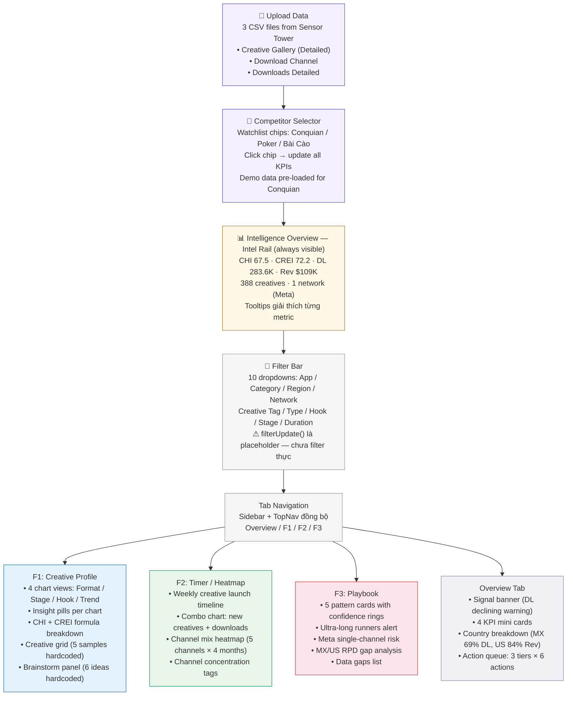
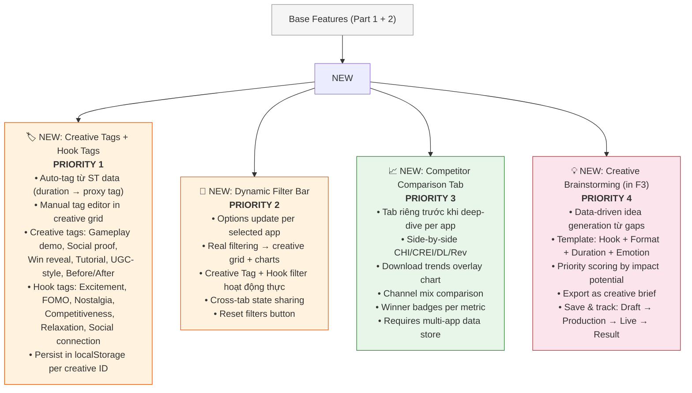

# ZPS Ad Intelligence — Project Structure Plan

---

## Part 1: Base Features (hiện tại)

Những gì tool **đã có** và đang hoạt động:



### Base Feature Status

| Feature | Status | Ghi chú |
| --- | --- | --- |
| CSV Upload (3 files) | ✅ Working | Parse + compute CHI/CREI + update UI |
| Competitor Selector | ✅ Working | 3 chips, click → update Intel Rail |
| Intel Rail (CHI/CREI/KPIs) | ✅ Working | Always visible, tooltips, delta badges |
| Overview Tab | ✅ Working | Signal banner, country breakdown, action queue |
| F1 Charts (Format/Stage/Hook/Trend) | ✅ Working | 4 chart views + insight pills |
| F1 CHI/CREI Formulas | ✅ Working | Expandable panels with sub-scores |
| F1 Creative Grid | ⚠️ Partial | 5 hardcoded samples, sort/view toggle not wired |
| F1 Brainstorm Panel | ⚠️ Partial | 6 ideas hardcoded, not data-driven |
| F2 Combo Chart | ✅ Working | New creatives vs downloads dual-axis |
| F2 Timeline | ⚠️ Partial | Hardcoded timeline items, not from CSV |
| F2 Heatmap | ⚠️ Partial | Hardcoded HTML cells, not from CSV |
| F3 Pattern Cards | ✅ Working | 5 patterns with confidence + recommended tests |
| Filter Bar | ❌ Placeholder | UI exists, `filterUpdate()` does nothing |
| Search in Selector | ❌ Not implemented | Search box exists but no logic |

### Data Flow (hiện tại)

```
ST CSV Upload → parseCSV() → analyzeUploads()
                                    ↓
                    Compute: CHI, CREI, stages, vid buckets,
                    downloads, revenue, countries, channels, HHI
                                    ↓
                    Update UI: Intel Rail + F1 charts (format, stage)
                                    ↓
                    ⚠ Heatmap, timeline, creative grid, playbook
                      vẫn dùng hardcoded data — chưa update từ CSV
```

---

## Part 2: Features cần tối ưu (base features chưa hoàn thiện)

Những gì đã có UI nhưng **chưa hoạt động đúng**:

| # | Feature | Vấn đề | Giải pháp |
| --- | --- | --- | --- |
| 1 | **Filter Bar** | `filterUpdate()` placeholder | Implement real filtering: lọc creative grid + update charts |
| 2 | **F1 Creative Grid** | 5 creatives hardcoded | Render từ parsed CSV data, wire sort/view toggle |
| 3 | **F2 Heatmap** | HTML cells hardcoded | Render dynamically từ Download Channel CSV |
| 4 | **F2 Timeline** | Static timeline items | Generate từ weekly creative launch data |
| 5 | **F3 Patterns** | Static pattern cards | Auto-detect patterns từ analyzed data |
| 6 | **Search box** | No logic | Client-side filter cho app chips |

---

## Part 3: New Features (chị yêu cầu bổ sung)

Tính năng **hoàn toàn mới**, layer lên base:



---

## Part 4: Updated Full Flow (sau khi implement tất cả)

```
┌─────────────────────────────────────────────────────────┐
│  UPLOAD: 3 CSV files per app (multi-app support)        │
└────────────────────────┬────────────────────────────────┘
                         ↓
┌─────────────────────────────────────────────────────────┐
│  COMPETITOR SELECTOR: Search + watchlist chips           │
│  Select app → filter options + data update dynamically  │
└────────────────────────┬────────────────────────────────┘
                         ↓
┌─────────────────────────────────────────────────────────┐
│  INTEL RAIL (always visible)                            │
│  CHI · CREI · DL · Rev · Creatives · Networks · Delta   │
└────────────────────────┬────────────────────────────────┘
                         ↓
┌─────────────────────────────────────────────────────────┐
│  FILTER BAR (persistent, dynamic per app)               │
│  Creative Tag ★ · Hook Tag ★ · Region · Network         │
│  Stage · Duration · Format    ★ = new priority filters  │
└────────────────────────┬────────────────────────────────┘
                         ↓
┌─────────────────────────────────────────────────────────┐
│  ★ COMPARISON TAB (NEW — all selected apps)             │
│  Side-by-side metrics · DL overlay · Channel comparison │
└────────────────────────┬────────────────────────────────┘
                         ↓ pick one app to deep-dive
         ┌───────────────┼───────────────┐
         ↓               ↓               ↓
┌────────────────┐ ┌──────────────┐ ┌──────────────────┐
│ F1: Creative   │ │ F2: Timer /  │ │ F3: Playbook     │
│ Profile        │ │ Heatmap      │ │ Advisor           │
│                │ │              │ │                    │
│ • Grid by      │ │ • Timeline   │ │ • Pattern cards   │
│   stage        │ │   from CSV   │ │ • Case studies    │
│ • ★ Tag system │ │ • Heatmap    │ │ • Suggested tests │
│ • Hook chart   │ │   from CSV   │ │ • ★ Brainstorm   │
│ • CHI breakdown│ │ • CREI trend │ │   idea generator  │
│ • Anomaly flags│ │ • Blitz badge│ │ • Export brief    │
└────────────────┘ └──────────────┘ └──────────────────┘
         ↑               ↑               ↑
         └───────────────┴───────────────┘
              All tabs share filter state
              Tags persist in localStorage
```

---

## Implementation Roadmap

```
Phase 0 (done):     Code cleanup — duplicates removed, bugs fixed
                    ✅ main.js, UploadPanel, TabPlaybook, CSS, Topbar

Phase 1 (tuần 1):  Hoàn thiện base features
                    ├── F1 Creative Grid render từ CSV data
                    ├── F2 Heatmap + Timeline render từ CSV data
                    └── F3 Pattern auto-detection

Phase 2 (tuần 2):  ★ Creative Tags + Hook Tags system
                    ├── Tag taxonomy + auto-tag from ST data
                    ├── Manual tag editor UI in creative grid
                    └── localStorage persistence

Phase 3 (tuần 2-3): ★ Dynamic Filter Bar
                    ├── Options update per selected app
                    ├── Real filtering → grid + charts
                    ├── Creative Tag + Hook Tag filters
                    └── Cross-tab state sharing

Phase 4 (tuần 3):  ★ Competitor Comparison Tab
                    ├── Multi-app data store
                    ├── Comparison table + overlay chart
                    └── Winner badges

Phase 5 (tuần 4):  ★ Creative Brainstorming in F3
                    ├── Data-driven idea generation
                    ├── Template system + priority scoring
                    └── Export brief function
```

★ = new feature (chị yêu cầu)
